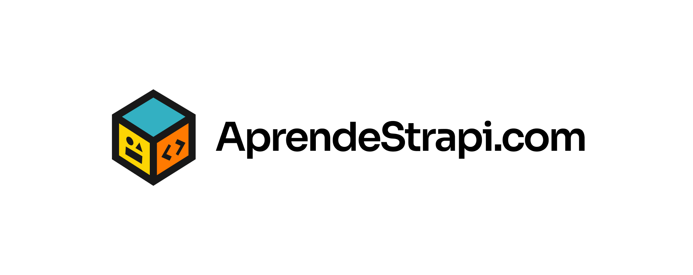

# Código base del curso AprendeStrapi.com

En este repositorio podrás encontrar todo el código que hemos realizado en cada una de las lecciones del curso de Strapi en AprendeStrapi.com.



El repositorio esta dividido por ramas desde las cuales podrás explorar el código base generado en cada una de las lecciones.

Por ejemplo: La rama `main` contiene el código base generado en la lección 4.

## 📚 Lecciones donde se genero código

[Lección 4: Crea tu primer proyecto con Strapi](https://github.com/aprende-strapi/codebase)

## Información de comandos de Strapi

Strapi viene con un completo [Command Line Interface](https://docs.strapi.io/dev-docs/cli) (CLI) que te permite andamiar y gestionar tu proyecto en segundos.

### `develop`

Inicia tu aplicación Strapi con recarga automática. [Más información](https://docs.strapi.io/dev-docs/cli#strapi-develop)

```
npm run develop
# or
yarn develop
```

### `start`

Inicia tu aplicación con recargado automático desactivado. [Más información](https://docs.strapi.io/dev-docs/cli#strapi-start)

```
npm run start
# or
yarn start
```

### `build`

Construye el panel de administración. [Más información](https://docs.strapi.io/dev-docs/cli#strapi-build)

```
npm run build
# or
yarn build
```

## 📚 Descubre más

- [Resource center](https://strapi.io/resource-center) - Strapi resource center.
- [Strapi documentation](https://docs.strapi.io) - Official Strapi documentation.
- [Strapi tutorials](https://strapi.io/tutorials) - List of tutorials made by the core team and the community.
- [Strapi blog](https://strapi.io/blog) - Official Strapi blog containing articles made by the Strapi team and the community.
- [Changelog](https://strapi.io/changelog) - Find out about the Strapi product updates, new features and general improvements.

&copy; 2024 AprendeStrapi.com
